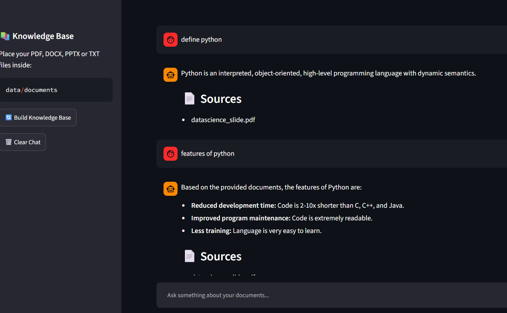
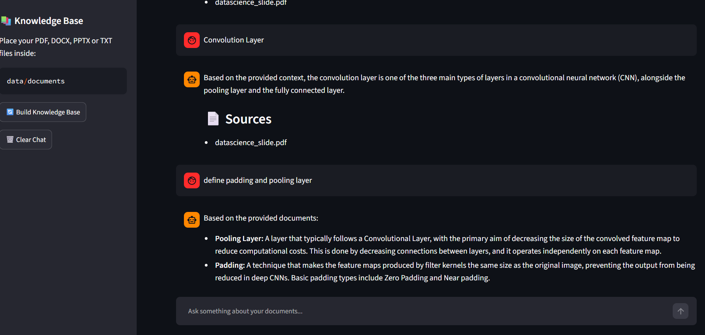
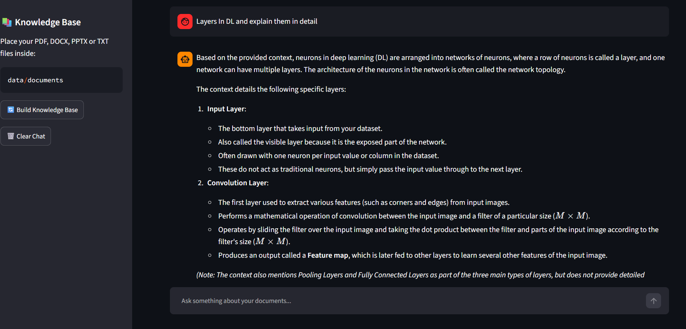
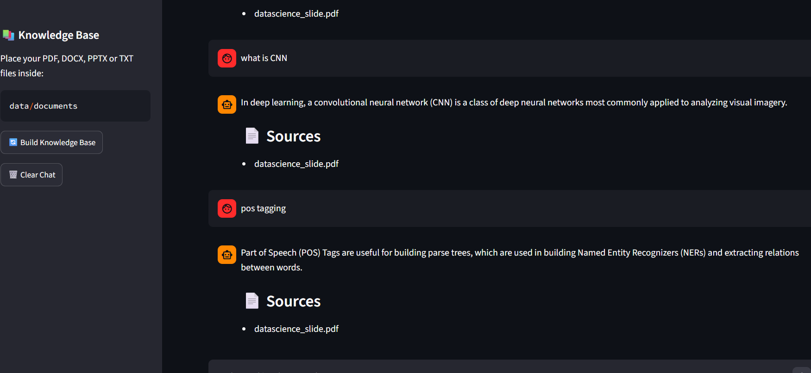
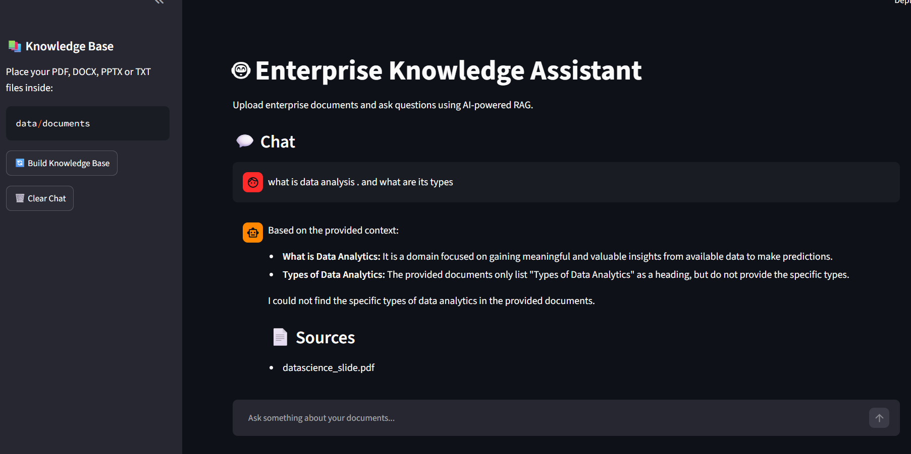

# 🤖 Enterprise Knowledge Assistant

An AI-powered **Enterprise Knowledge Assistant** built using **Retrieval-Augmented Generation (RAG)** that allows users to upload and interact with multiple documents through a conversational AI interface.

Instead of asking questions from a single PDF, the system creates a searchable knowledge base from **multiple documents** and retrieves relevant information before generating an answer.

---

## 🚀 Project Overview

Organizations often store important information across documents such as:

* 📄 Company policies
* 📑 Standard Operating Procedures (SOPs)
* 📚 Training and reference documents
* 👥 HR documentation
* 🏢 Internal business documents
* 📋 Technical documentation

Searching through multiple documents manually can be time-consuming.

This project demonstrates how **Generative AI + RAG + Vector Search** can be used to build an intelligent knowledge assistant that allows users to ask questions in natural language and receive context-aware answers from their uploaded documents.

---

## ✨ Key Features

* 📚 **Multi-document knowledge base**
* 📄 Supports **PDF documents**
* 📝 Supports **DOCX documents**
* 📊 Supports **PPTX documents**
* 📃 Supports **TXT documents**
* ✂️ Automatic document text extraction and chunking
* 🧠 Semantic embedding generation
* 🔎 Vector similarity search
* 🗂️ FAISS-based vector store
* 🤖 Gemini-powered answer generation
* 💬 Conversational question answering
* 🔄 Retrieval-Augmented Generation (RAG)
* 🖥️ Interactive Streamlit interface

---

## 🧠 How RAG Works

The application follows a standard Retrieval-Augmented Generation workflow:

```text
              User Documents
                    │
                    ▼
          Document Text Extraction
                    │
                    ▼
             Text Chunking
                    │
                    ▼
          Embedding Generation
                    │
                    ▼
             FAISS Vector Store
                    │
                    │
             User Question
                    │
                    ▼
          Question Embedding
                    │
                    ▼
        Similarity Search / Retrieval
                    │
                    ▼
         Relevant Document Chunks
                    │
                    ▼
              Gemini LLM
                    │
                    ▼
             Final Answer
```

### Why RAG?

Instead of relying only on the LLM's pre-trained knowledge, RAG retrieves relevant information from the user's documents and provides that context to the model.

This helps the assistant answer questions based on the uploaded knowledge base.

---

## 🏗️ Project Architecture

```text
Enterprise Knowledge Assistant
│
├── Streamlit Application
│
├── Document Processing
│   ├── PDF
│   ├── DOCX
│   ├── PPTX
│   └── TXT
│
├── Text Chunking
│
├── Embedding Generation
│
├── FAISS Vector Database
│
├── Similarity Retrieval
│
└── Gemini LLM
        │
        ▼
   AI Generated Answer
```

---

## 🛠️ Technology Stack

### Programming Language

* Python

### Generative AI

* Google Gemini

### RAG & AI Framework

* LangChain

### Vector Search

* FAISS

### Document Processing

* PyPDF2
* python-docx
* python-pptx

### Machine Learning / NLP

* Embeddings
* Semantic Search
* Vector Similarity

### Frontend

* Streamlit

### Development

* VS Code
* Python Virtual Environment
* Git & GitHub

---

## 📂 Project Structure

```text
enterprise-knowledge-assistant/
│
├── app.py
├── README.md
├── requirements.txt
│
└── src/
    ├── __init__.py
    ├── document_loader.py
    ├── embeddings.py
    ├── rag.py
    └── vector_store.py
```

### Main Components

**`app.py`**
Main Streamlit application and user interface.

**`document_loader.py`**
Loads and extracts text from supported document formats.

**`embeddings.py`**
Handles document embedding generation.

**`vector_store.py`**
Creates and manages the FAISS vector store.

**`rag.py`**
Connects document retrieval with the LLM to generate context-aware answers.

---

## ⚙️ Installation & Setup

### 1. Clone the Repository

```bash
git clone https://github.com/ayush-parashar-ds/enterprise-knowledge-assistant.git
cd enterprise-knowledge-assistant
```

### 2. Create a Virtual Environment

```bash
python -m venv venv
```

Activate it on Windows:

```bash
venv\Scripts\activate
```

### 3. Install Dependencies

```bash
pip install -r requirements.txt
```

### 4. Configure API Key

Create a `.env` file in the project root:

```text
GOOGLE_API_KEY=your_api_key_here
```

⚠️ **Never upload your `.env` file or API key to GitHub.**

### 5. Run the Application

```bash
streamlit run app.py
```

The application will open in your browser.

---

## 💡 Example Use Case

An organization can upload multiple documents such as:

```text
HR_Policy.pdf
Employee_Handbook.pdf
Leave_Policy.docx
Company_Guidelines.pptx
Training_Guide.txt
```

The assistant can then answer questions such as:

> "What is the company's leave policy?"

> "What are the employee benefits?"

> "Summarize the uploaded training document."

> "What are the important guidelines mentioned in the documents?"

The system retrieves relevant document information and uses it as context for generating the response.

---

## 🏢 Potential Industrial Applications

This type of RAG-based knowledge assistant can be adapted for:

* 🏢 Enterprise internal knowledge bases
* 👥 HR policy assistants
* 💻 IT support knowledge systems
* 📚 Educational institutions
* 🏥 Healthcare documentation systems
* ⚙️ Technical documentation assistants
* 📋 SOP and compliance document search
* 🎓 Employee onboarding systems
* 🛠️ Customer support knowledge bases

---

## 📸 Screenshots

### Application Interface



### Multiple Document Knowledge Base



### Knowledge Base Processing



### AI Question Answering



### Document-Based Responses



---

## 🎯 Learning Outcomes

Through this project, I gained practical experience with:

* Retrieval-Augmented Generation (RAG)
* Large Language Models (LLMs)
* Document processing
* Text chunking
* Embeddings
* Vector databases
* Semantic search
* FAISS
* LangChain
* Google Gemini
* Streamlit
* Building an end-to-end Generative AI application

---

## 🔮 Future Improvements

Possible future enhancements include:

* 🔐 User authentication and role-based access
* 📌 Source citations for retrieved information
* 🔎 Hybrid search
* 🎯 Reranking of retrieved documents
* 📊 RAG evaluation and performance monitoring
* ☁️ Cloud deployment
* 🗃️ Production vector database such as Pinecone
* 💾 Persistent conversation history
* 📈 Analytics dashboard

---

## 👨‍💻 Author

**Ayush Parashar**

B.Tech – Computer Science Engineering

Interested in **Data Science, Machine Learning, Generative AI and RAG Systems**.

GitHub:
https://github.com/ayush-parashar-ds

---

## ⭐ Project

If you find this project useful or interesting, feel free to ⭐ the repository.
